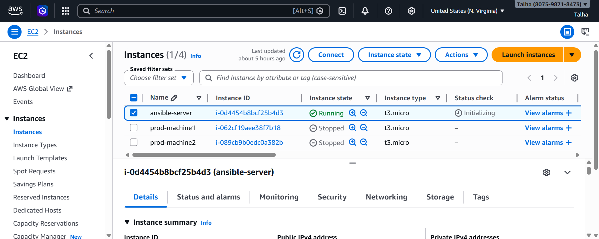
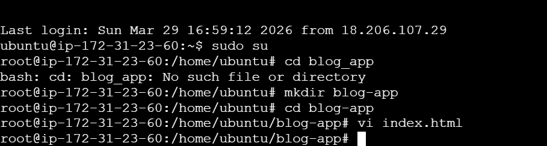
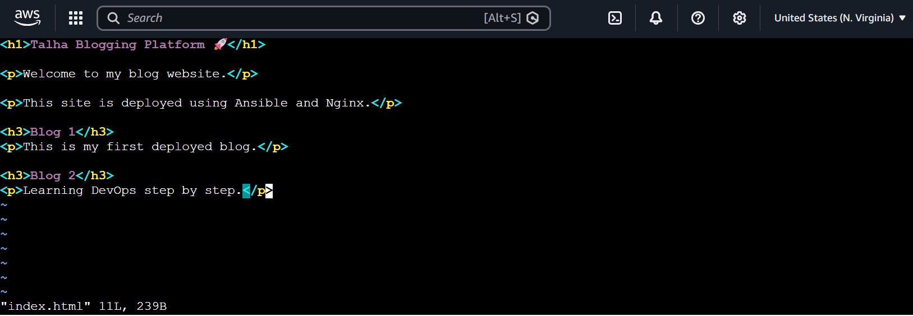
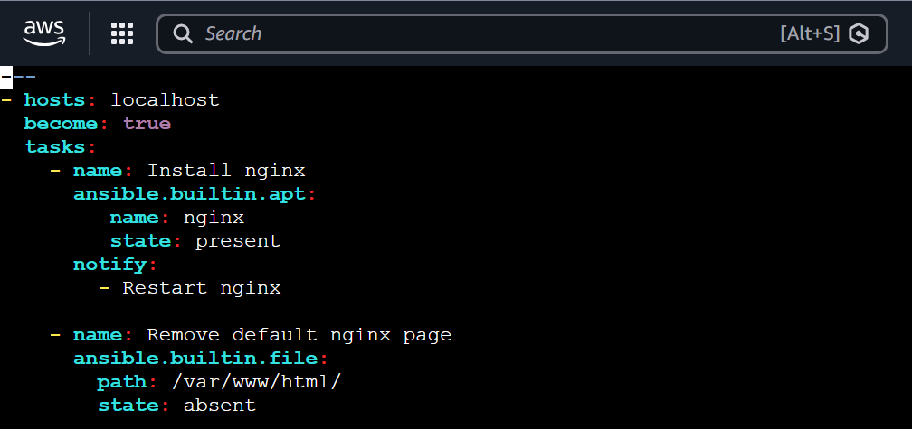
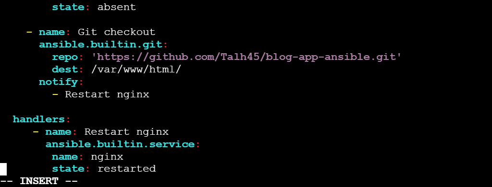
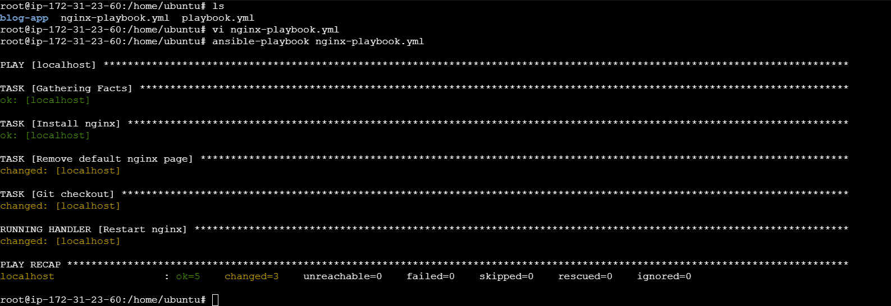
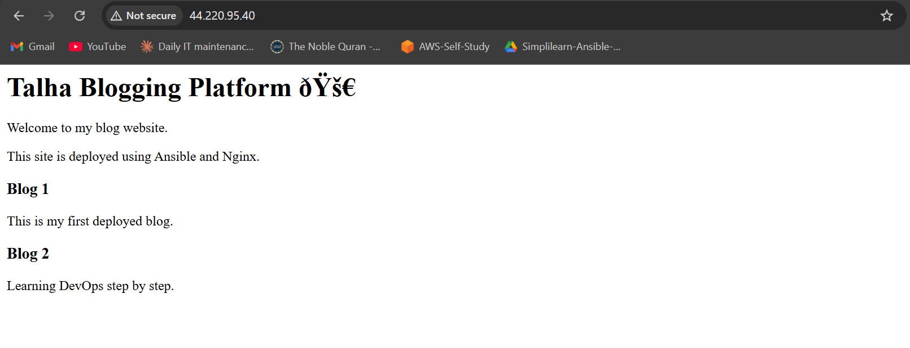
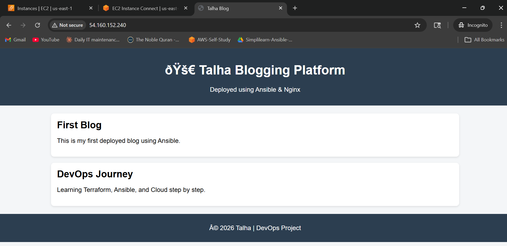

# Web Application Deployment using Ansible & Nginx

## Overview

This project demonstrates automated deployment of a static web application on an AWS EC2 instance using Ansible and Nginx.

The application is stored on GitHub and deployed automatically using an Ansible playbook.

---

## ⚙️ Technologies Used

* Ansible
* Nginx
* AWS EC2
* Git & GitHub
* Linux (Ubuntu)

---

## 🔧 Features

* Automated installation of Nginx
* Removal of default Nginx web page
* Deployment of website from GitHub repository
* Service restart using Ansible handlers
* End-to-end automation of web deployment

---

## 📂 Project Structure

```
blog-app-ansible/
├── index.html
├── nginx-playbook.yml
└── README.md
```

---

## ▶️ How to Run

### 1. Connect to EC2

```
ssh -i key.pem ubuntu@54.160.152.240
```

### 2. Run Ansible Playbook

```
ansible-playbook nginx-playbook.yml
```

---

## 🌐 Output

Access the deployed application in browser:

```
http://54.160.152.240
```

---

## 📸 Screenshots

### ⚙️ Execution Steps















### 🌐 Final Website Output




---

## 🧠 Learning Outcomes

* Hands-on experience with Ansible automation
* Understanding of web server deployment using Nginx
* GitHub integration with deployment workflow
* Troubleshooting real-world issues (SSH, networking, permissions)

---

##  Future Improvements

* Integrate Terraform for infrastructure automation
* Add security features (UFW, Fail2Ban)
* Implement monitoring and logging
  
## My next Project will have all of the above integrations

---

## 💼 Author

**Talha**
DevOps & Cybersecurity Enthusiast
